# Capstone-Project-Early-Detection-of-Anemia-Based-on-Digital-Imagery
Project Capstone Coding Camp DBS 2025 Group CC25-CF291


## Background

According to progress conducted by Brittenham et al. (2023) about understanding the topic of anemia, it was discovered that anemia can be caused by several factors including iron deficiency, infection, be it from parasites, viruses, or bacteria, and genetic condition. Treatment for infections also has a possibility to cause anemia.

Our Capstone team developed a website application that aims to detect early symptoms of anemia. This document will cover the Machine Learning portion of the whole project. symptoms of anemia can be found through the color of the conjunctiva (palpebral conjunctiva) of the eye. The conjunctiva of the eye is one of the most effective physical indicators in indicating if someone has symptoms of anemia. (Sheth et al., 1997) Anemia itself is a condition where the body lacks hemoglobin caused by various deep factors, meaning that anemia can be an early indicator that someone may have other serious health problems that cause the lack of hemoglobin. 

Although the conjunctiva itself cannot be used as a reference for diagnosing anemia, if someone's conjunctiva looks pale, then the physical detection (conjunctiva) is enough to make a patient get a hemoglobin determination test, which is a test to measure a person's hemoglobin levels. (Sheth et al., 1997)

As mentioned, this document will cover the Machine Learning portion of the project. The entire machine learning side will have two models, one for segmentation and one for classification. Segmentation will use YOLO to segment the captured image, crop the segmented conjunctiva, and outputs it as the new image. Classification model will classify the segmented conjunctiva image produced by the previously mentioned YOLO model, and determines if the image indicates if someone is Anemic or Non-Anemic.

This document will cover the whole proses of creating the classification model, starting from dataset gathering, all the way to model evaluation and model inference.

## Data Understanding

The data used for training the model was gathered from kaggle. It is a general dataset for physiological anemia detection, as it contains 3 folders (Conjunctiva, Finger_Nails, Palm) with each having images that shows the representation of both classes, Anemic and Non-Anemic. Each folders have already been split into train-test-validation set. The data is augmented and cleaned as suggested by the name of the dataset. For the purposes of this project, only the data containing conjunctiva images will be used. 

The distribution of the whole dataset can be seen below:

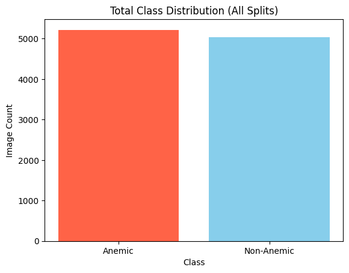

The distribution of each split can be seen below:

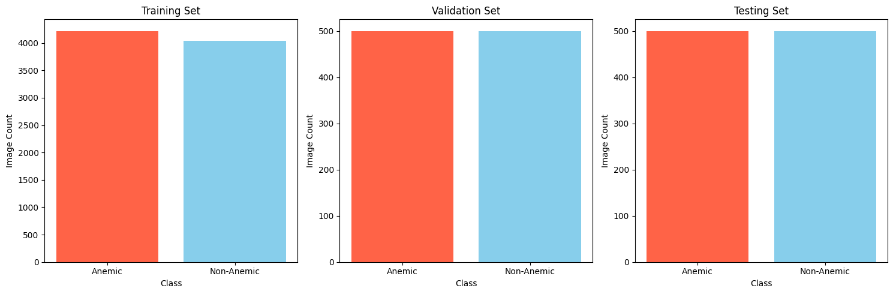

[Dataset Link](https://www.kaggle.com/datasets/t2obd1a1253kmit/clean-augmented-anemia-dataset)

## Modeling

This modeling step will leverage the capabilities of pre-trained models and utilize transfer learning as well as fine tuning for enhanced performance. We'll be using resnet50 for the classification model. Details can be seen below:

```
Model: "sequential"

┏━━━━━━━━━━━━━━━━━━━━━━━━━━━━━━━━━┳━━━━━━━━━━━━━━━━━━━━━━━━┳━━━━━━━━━━━━━━━┓
┃ Layer (type)                    ┃ Output Shape           ┃       Param # ┃
┡━━━━━━━━━━━━━━━━━━━━━━━━━━━━━━━━━╇━━━━━━━━━━━━━━━━━━━━━━━━╇━━━━━━━━━━━━━━━┩
│ resnet50 (Functional)           │ (None, 7, 7, 2048)     │    23,587,712 │
├─────────────────────────────────┼────────────────────────┼───────────────┤
│ global_average_pooling2d        │ (None, 2048)           │             0 │
│ (GlobalAveragePooling2D)        │                        │               │
├─────────────────────────────────┼────────────────────────┼───────────────┤
│ dense (Dense)                   │ (None, 64)             │       131,136 │
├─────────────────────────────────┼────────────────────────┼───────────────┤
│ dropout (Dropout)               │ (None, 64)             │             0 │
├─────────────────────────────────┼────────────────────────┼───────────────┤
│ dense_1 (Dense)                 │ (None, 2)              │           130 │
└─────────────────────────────────┴────────────────────────┴───────────────┘

 Total params: 23,718,978 (90.48 MB)

 Trainable params: 131,266 (512.76 KB)

 Non-trainable params: 23,587,712 (89.98 MB)
```

## Evaluation

The first training session will take 10 epochs both before fine-tuning and while fine-tuning, totalling 20 epochs for the whole training process. The results can be seen below:

- Pre Fine-tuning:
    - ACC:

    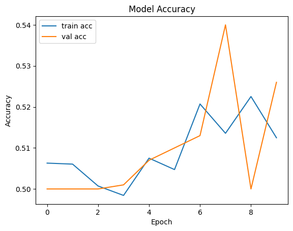

    - LOSS:

    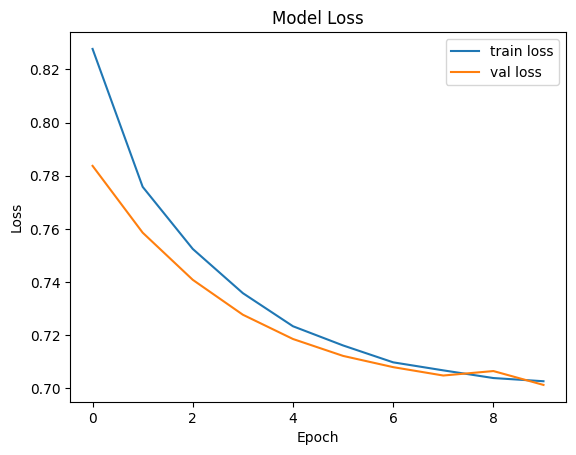

    - CONFUSION MATRIX:

    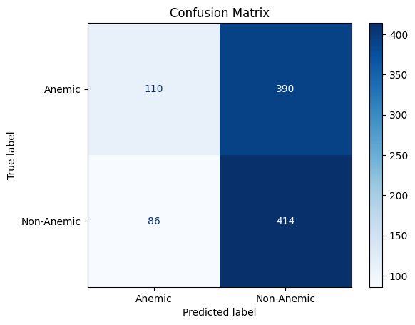


- Fine-tuning:
    - ACC:

    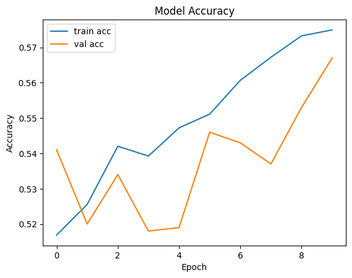

    - LOSS:

    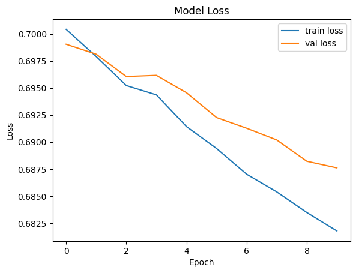

- Inference:

    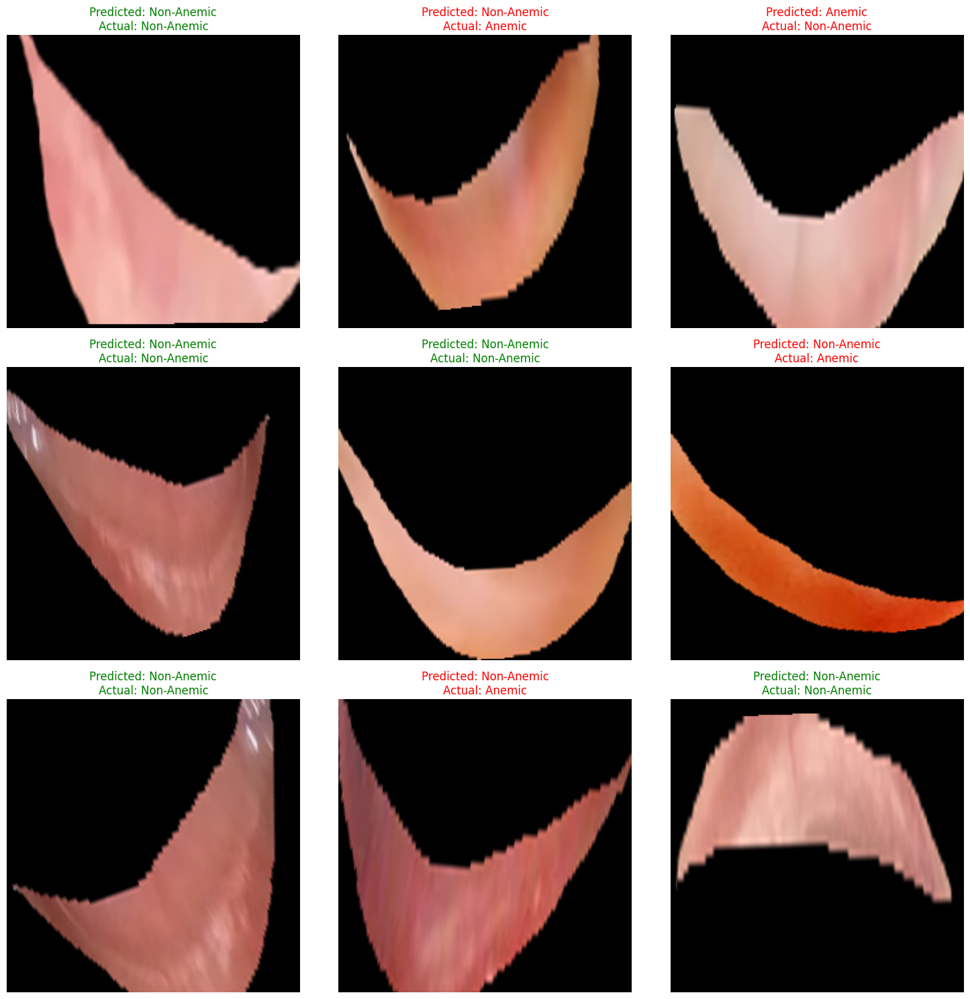

Let's go over the training evaluation from the beginning. First, prior to fine-tuning, the model reached about 52% of accuracy. Undoubtedly, the training seems to have trouble converging with the validation set in terms of accuracy. However, the loss plot is very smooth and consistent.

The Confusion Matrix tells us that the model has a tendency to fail when predicting Anemic class with a high number of False Negatives. This may indicate inconsistencies in the Anemic class, such that it confuses the model in understanding what makes the Anemic class different from Non-Anemic. Fine tuning managed to improve the accuracy by about 7% (accuracy is now 59%), reaching convergence in both the accuracy and the loss for both train and validation. As for the inference, the model managed to correctly predict 5 out of 9 selected samples from the test set. However, as we've mentioned about our suspicion about the quality of the data, there might still be a lack of definitive conclusion to be drawn from this inference test. Not to mention, some of the images seem to have been labeled as Non-Anemic despite clearly visible pallor on the palpebral conjunctiva.

This section will cover what improvements can be gathered by increasing the epoch of the training up to 10 epoch each (prior and during fine-tuning), totalling 40. epochs for the whole training process.

The results can be seen below:

- Pre Fine-tuning:
    - ACC:

    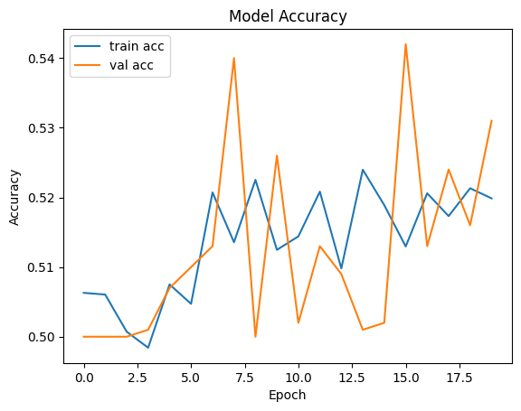

    - LOSS:

    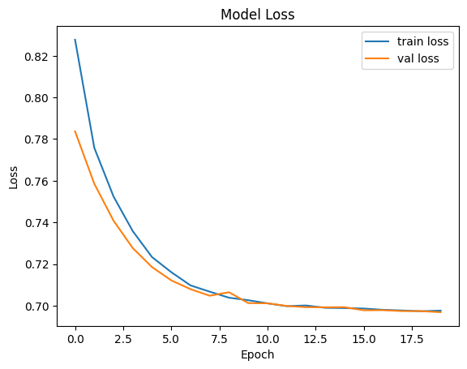

    - CONFUSION MATRIX:

    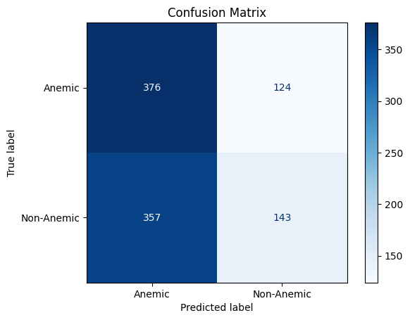


- Fine-tuning:
    - ACC:

    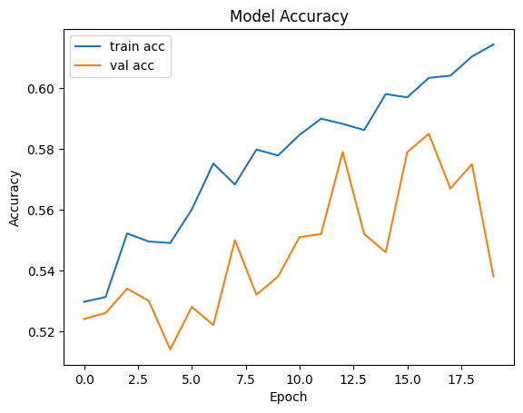

    - LOSS:

    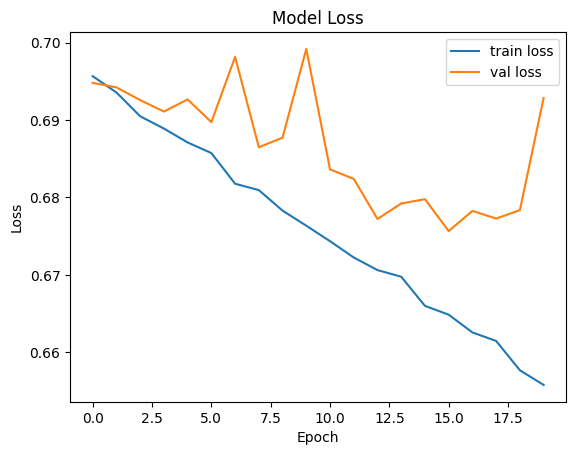

- Inference:

    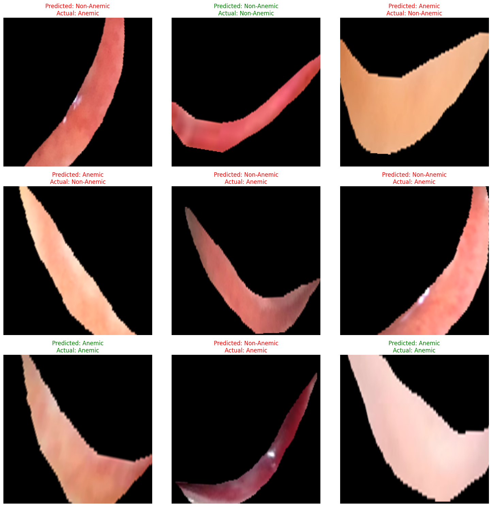

Using 20 epochs seemed to have confused the model even more, with the majority of false prediction now falls into the false positive category. furthermore, the model could only predict 3 out of 9 test samples correctly, which might be a decrease in quality on the surface. However, upon closer inspection of the inference test, we can see that this model now understands what makes a conjunctiva Anemic, which is the pallor of the conjunctiva itself. This model is able to classify that properly, despite occasionally producing different output from the sampel's label. This proves that the model is now capable of handling this classification task, and can be taken into the next steps of the development process.

## Conclusion

Although the metrics used to measure the models performance yields unsatisfactory results, the fact that both models generated sensible predictions means that this model is somewhat usable to be used in this project. Steps that can be taken to improve upon this current work includes fine tuning the model, analyze the currently used dataset, and find other metrics that can enlighten us about how the model actually performs. However, as time is a resource that constantly depletes over the course of this project's development process, our team has decided that the current model will be integrated to the web application interface, to ensure that the main priorities of the whole project can be met and the application side of the development can be continued without further delays.

## References

Brittenham, G. M., Moir-Meyer, G., Abuga, K. M., Datta-Mitra, A., Cerami, C., Green, R., Pasricha, S.-R., & Atkinson, S. H. (2023). Biology of anemia: A public health perspective. The Journal of Nutrition, 153(Supplement 1), S7–S28. https://doi.org/10.1016/j.tjnut.2023.07.018

Sheth, T.N., BartsSc, , Choudhry, N.K., Bowes, M. and Detsky, A.S. (1997), The Relation of Conjunctival Pallor to the Presence of Anemia. Journal of General Internal Medicine, 12: 102-106. https://doi.org/10.1046/j.1525-1497.1997.00014.x
